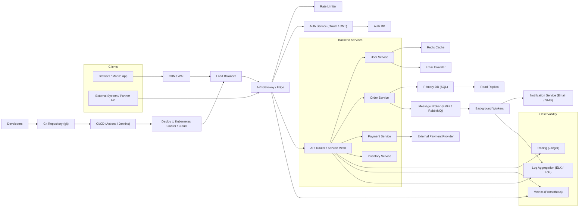

# Architecture Overview

This document contains a high-level architecture diagram for a typical cloud-native web application. It shows clients, edge components, API gateway, backend services, data stores, background processing, external integrations, observability, and CI/CD.

Legend:
- CDN/WAF: edge caching and security
- API Gateway: routing, auth enforcement, request shaping
- Service Mesh / API Router: internal service-to-service communication and observability
- MQ + Workers: asynchronous processing for long-running tasks
- Observability: tracing, metrics, and aggregated logs for SRE and troubleshooting
- CI/CD: automated build/test/deploy pipeline

Notes:
- Replace components (Kafka, Redis, SQL, monitoring tools) with concrete technologies you use.
- Consider adding per-service autoscaling, multi-AZ databases, and backup/DR details depending on requirements.
